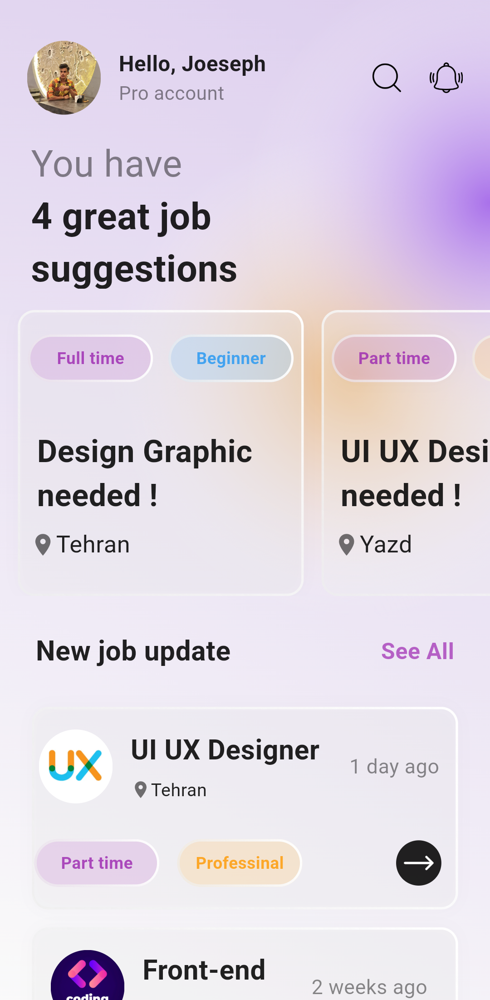
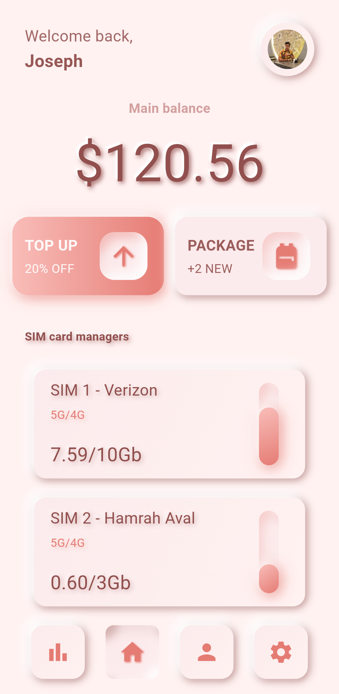

# Glassmorphism & Neumorphism UI Themes

This repository showcases two modern UI design trends implemented in Android applications:

- **Glassmorphism**: Frosted glass-like interface with blurred background and translucent cards.
- **Neumorphism**: Soft UI style with subtle shadows and extruded surfaces.

## 🖼️ Theme Previews

### Glassmorphism  & Neumorphism
<p>
  
  
<p/>

---

## 📱 Features

- **Glassmorphism Theme**:
  - Blurred background effects
  - Translucent surfaces
  - Smooth animations

- **Neumorphism Theme**:
  - Light & shadow soft UI
  - Convex and concave components
  - Minimal color palettes

---

## 🛠️ Tech Stack

- Kotlin
- Android SDK (API 21+)
- Material Design 3

---

## 📂 Project Structure

```
lib/
├── assets/
│   └── ... (source files)
├── neumorphism
│   └── ... (source files)
├── glassmorphism
   └── ... (source files)
```

---

## 🚀 Getting Started

### Prerequisites
- Android Studio Hedgehog or later
- Gradle 8+

### Clone the Repository
```bash
git clone https://github.com/your-username/GlassAndNeumorphismThemes.git
cd GlassAndNeumorphismThemes
```

### Open in Android Studio
- Open each theme's file (`Glassmorphism.dart` or `Neumorphism.dart`) as a separate project if needed.

---

## 🙌 Author

Designed & Developed by **Yousef Yousefian**

Feel free to ⭐ the repo and follow for more concepts!

---

## 📬 Contact

For collaborations or feedback:
- Email: yousef.yousefian.85@gmail.com
- GitHub: [@yyzadeh](https://github.com/yyzadeh)
